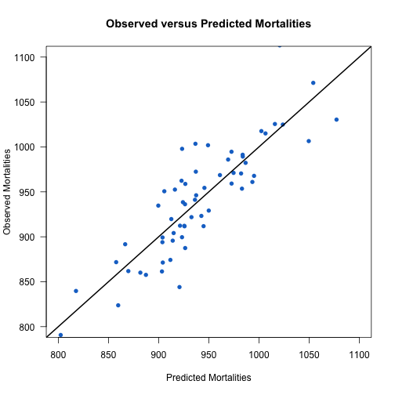
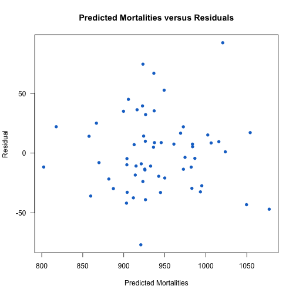
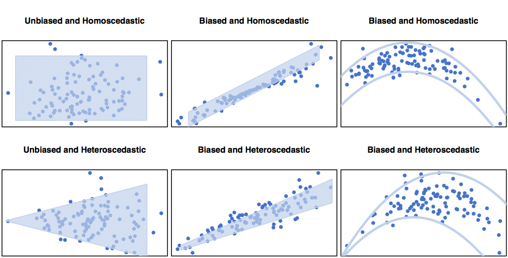
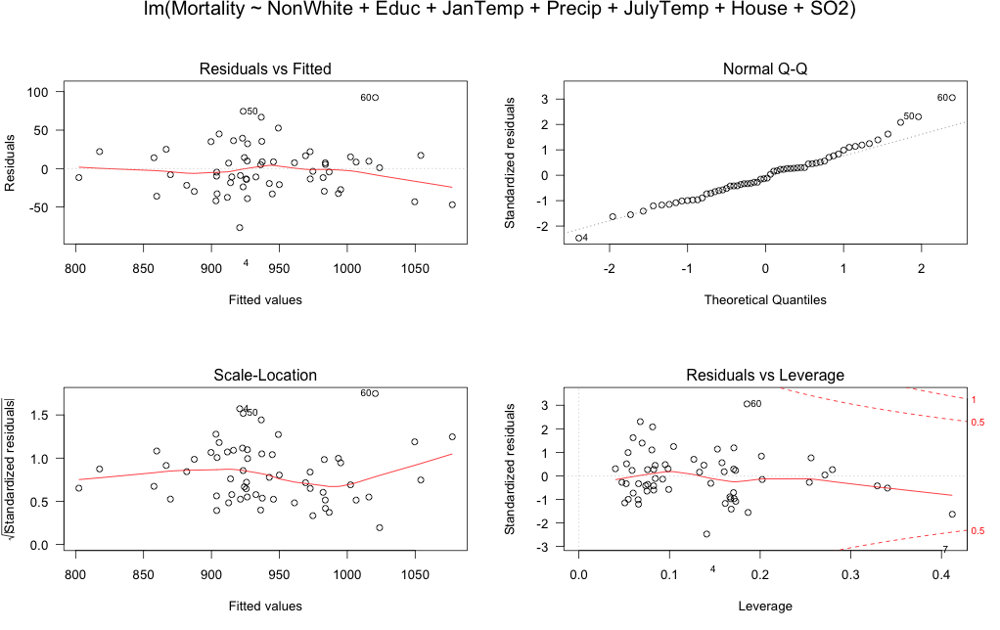

Some Fun with Regressions
========================================================
author: Christopher Wetherill
date: 24 July 2014
css: regressions.css


Predicting Mortality via Stepwise Regression
============================================


Now let's work with multiple and stepwise regressions. In this example, we will predict a city's mortality rate based off of any of several environmental variables.

<!-- html table generated in R 3.1.1 by xtable 1.7-3 package -->
<!-- Wed Jul 23 11:41:43 2014 -->
<TABLE border=1>
<TR> <TH>  </TH> <TH> CITY </TH> <TH> Mortality </TH> <TH> Precip </TH> <TH> Humidity </TH> <TH> JanTemp </TH> <TH> JulyTemp </TH>  </TR>
  <TR> <TD align="right"> 1 </TD> <TD> San Jose, CA </TD> <TD align="right"> 790.73 </TD> <TD align="right">  13 </TD> <TD align="right">  71 </TD> <TD align="right">  49 </TD> <TD align="right">  68 </TD> </TR>
  <TR> <TD align="right"> 2 </TD> <TD> Wichita, KS </TD> <TD align="right"> 823.76 </TD> <TD align="right">  28 </TD> <TD align="right">  54 </TD> <TD align="right">  32 </TD> <TD align="right">  81 </TD> </TR>
  <TR> <TD align="right"> 3 </TD> <TD> San Diego, CA </TD> <TD align="right"> 839.71 </TD> <TD align="right">  10 </TD> <TD align="right">  61 </TD> <TD align="right">  55 </TD> <TD align="right">  70 </TD> </TR>
  <TR> <TD align="right"> 4 </TD> <TD> Lancaster, PA </TD> <TD align="right"> 844.05 </TD> <TD align="right">  43 </TD> <TD align="right">  54 </TD> <TD align="right">  32 </TD> <TD align="right">  74 </TD> </TR>
  <TR> <TD align="right"> 5 </TD> <TD> Minneapolis, MN </TD> <TD align="right"> 857.62 </TD> <TD align="right">  25 </TD> <TD align="right">  58 </TD> <TD align="right">  12 </TD> <TD align="right">  73 </TD> </TR>
  <TR> <TD align="right"> 6 </TD> <TD> Dallas, TX </TD> <TD align="right"> 860.10 </TD> <TD align="right">  35 </TD> <TD align="right">  54 </TD> <TD align="right">  46 </TD> <TD align="right">  85 </TD> </TR>
   </TABLE>

Our Predictor Variables
======================
- Mean annual precipitation
- Average humidity
- Mean Jan. temp
- Mean July temp
- Percent residents >65
- Mean household population
- Mean years education
- Percent structurally sound housing

***

- Population density
- Percent non-white population
- Percent with white-collar job
- Percent houses below poverty line
- Hydrocarbon pollution potential
- NOX pollution potential
- SO2 pollution potential

Which To Choose?
================

Well, we could start with an omnibus model where every possible predictor is included in the model:


```r
fit <- lm(Mortality ~ Precip + Humidity + JanTemp +
            JulyTemp + Over65 + House + Educ + Sound +
            Density + NonWhite + WhiteCol + Poor + HC +
            NOX + SO2, data = data)
```

But That's Useless...
=====================


```r
Coefficients:
              Estimate Std. Error t value Pr(>|t|)    
(Intercept)  1.762e+03  4.371e+02   4.032 0.000216 ***
Precip       1.905e+00  9.233e-01   2.063 0.045066 *  
Humidity     1.061e-01  1.169e+00   0.091 0.928048    
JanTemp     -1.935e+00  1.108e+00  -1.746 0.087753 .  
JulyTemp    -3.102e+00  1.901e+00  -1.632 0.109862    
Over65      -9.045e+00  8.483e+00  -1.066 0.292111    
House       -1.065e+02  6.977e+01  -1.527 0.134030    
Educ        -1.707e+01  1.186e+01  -1.439 0.157246    
Sound       -6.594e-01  1.768e+00  -0.373 0.710920    
Density      3.660e-03  4.026e-03   0.909 0.368265    
NonWhite     4.460e+00  1.326e+00   3.363 0.001604 ** 
WhiteCol    -1.923e-01  1.661e+00  -0.116 0.908377    
Poor        -1.653e-01  3.225e+00  -0.051 0.959362    
HC          -6.722e-01  4.908e-01  -1.370 0.177784    
NOX          1.340e+00  1.005e+00   1.333 0.189349    
SO2          8.612e-02  1.475e-01   0.584 0.562185    
---
Signif. codes:  0 ‘***’ 0.001 ‘**’ 0.01 ‘*’ 0.05 ‘.’ 0.1 ‘ ’ 1

Residual standard error: 34.91 on 44 degrees of freedom
Multiple R-squared:  0.7651,  Adjusted R-squared:  0.685 
F-statistic: 9.552 on 15 and 44 DF,  p-value: 2.16e-09
```

Try Forward Stepwise Regression?
================================

Instead, let's start small and build our model up:


```r
data <- subset(data, select = c(Mortality:SO2))

fit2 <- glm(Mortality~1, data = data)

step.forward <- stepAIC(
  fit2, direction="forward",
  scope=list(upper = ~ Precip + Humidity + JanTemp +
               JulyTemp + Over65 + House + Educ + Sound +
               Density + NonWhite + WhiteCol + Poor + HC +
               NOX + SO2,lower=~1),
  trace=TRUE)
```

The Process...
==============
- Mortality ~ 1
- Mortality ~ NonWhite
- Mortality ~ NonWhite + Educ
- Mortality ~ NonWhite + Educ + JanTemp
- Mortality ~ NonWhite + Educ + JanTemp + SO2
- Mortality ~ NonWhite + Educ + JanTemp + SO2 + Precip
- Mortality ~ NonWhite + Educ + JanTemp + SO2 + Precip + JulyTemp
- Mortality ~ NonWhite + Educ + JanTemp + SO2 + Precip + JulyTemp + House

And the Results
===============


```

Call:
lm(formula = Mortality ~ NonWhite + Educ + JanTemp + SO2 + Precip + 
    JulyTemp + House)

Residuals:
   Min     1Q Median     3Q    Max 
-76.75 -21.04  -3.98  15.56  92.38 

Coefficients:
             Estimate Std. Error t value Pr(>|t|)    
(Intercept) 1429.1098   215.7240    6.62  2.0e-08 ***
NonWhite       5.2157     0.8270    6.31  6.3e-08 ***
Educ         -16.9620     6.8185   -2.49   0.0161 *  
JanTemp       -1.8936     0.5889   -3.22   0.0022 ** 
SO2            0.2253     0.0815    2.76   0.0079 ** 
Precip         1.6485     0.6034    2.73   0.0086 ** 
JulyTemp      -2.3002     1.2338   -1.86   0.0679 .  
House        -62.0069    44.7748   -1.38   0.1720    
---
Signif. codes:  0 '***' 0.001 '**' 0.01 '*' 0.05 '.' 0.1 ' ' 1

Residual standard error: 33.5 on 52 degrees of freedom
Multiple R-squared:  0.744,	Adjusted R-squared:  0.71 
F-statistic: 21.6 on 7 and 52 DF,  p-value: 2.4e-13
```

What About Backwards Selection?
==============================

Alternately, we can start large and remove elements to refine our model:


```r
fit <- lm(Mortality ~ Precip + Humidity + JanTemp +
            JulyTemp + Over65 + House + Educ + Sound +
            Density + NonWhite + WhiteCol + Poor + HC +
            NOX + SO2, data = data)

step.back <- stepAIC(fit,direction="backward",trace=TRUE)
```

The Process...
==============

- Mortality ~ Precip + Humidity + JanTemp + JulyTemp + Over65 + House + Educ + Sound + Density + NonWhite + WhiteCol + Poor + HC + NOX + SO2
- Remove Poor
- Remove Humidity
- Remove WhiteCol
- Remove Sound
- Remove SO2
- Remove Density
- Mortality ~ Precip + JanTemp + JulyTemp + Over65 + House + Educ + NonWhite + HC + NOX

And the Results
===============


```

Call:
lm(formula = Mortality ~ Precip + JanTemp + JulyTemp + Over65 + 
    House + Educ + NonWhite + HC + NOX)

Residuals:
   Min     1Q Median     3Q    Max 
-71.08 -22.01   0.68  16.89  79.69 

Coefficients:
            Estimate Std. Error t value Pr(>|t|)    
(Intercept) 1934.025    333.449    5.80  4.5e-07 ***
Precip         1.856      0.837    2.22   0.0312 *  
JanTemp       -2.262      0.696   -3.25   0.0021 ** 
JulyTemp      -3.320      1.397   -2.38   0.0213 *  
Over65       -10.921      7.139   -1.53   0.1324    
House       -137.385     59.766   -2.30   0.0257 *  
Educ         -23.419      7.061   -3.32   0.0017 ** 
NonWhite       4.662      0.969    4.81  1.4e-05 ***
HC            -0.922      0.319   -2.89   0.0057 ** 
NOX            1.871      0.609    3.07   0.0035 ** 
---
Signif. codes:  0 '***' 0.001 '**' 0.01 '*' 0.05 '.' 0.1 ' ' 1

Residual standard error: 33.3 on 50 degrees of freedom
Multiple R-squared:  0.758,	Adjusted R-squared:  0.714 
F-statistic: 17.4 on 9 and 50 DF,  p-value: 1.48e-12
```

How do They Compare?
===================

The models end up roughly comparable and share the first 6 predictor terms. An ANOVA reveals no significant differences between the two. For parsimony, let's choose our first model.


```r
Mortality ~ NonWhite + Educ + JanTemp + Precip + JulyTemp + House + SO2

Multiple R-squared:  0.7443,  Adjusted R-squared:  0.7099 
F-statistic: 21.62 on 7 and 52 DF,  p-value: 2.399e-13

Mortality ~ NonWhite + Educ + JanTemp + Precip + JulyTemp + House + Over65 + HC + NOX

Multiple R-squared:  0.7576,  Adjusted R-squared:  0.7139 
F-statistic: 17.36 on 9 and 50 DF,  p-value: 1.476e-12
```


```
  Res.Df   RSS Df Sum of Sq    F Pr(>F)
1     52 58368                         
2     50 55343  2      3025 1.37   0.26
```

Evaluating Our Model
====================

 
***
Here, a perfectly-fitted model would have every single point fall directly on the plotted line. Although we don't see that, it does look like the model does a good job predicting each city's average annual mortality rate.

Evaluating Our Model
====================

We can also evaluate a plot of our residuals against our fitted values. An evenly-distributed spread indicates that the model is fairly well fitted to the data.
***
 

Interpreting Residuals
======================



Robust Regression
======================



Flagging High Residuals
=======================

Let's also take a look at which rows have the largest residuals:


```r
Distance <- cooks.distance(fit)
Resid <- stdres(fit)
Resid <- abs(Resid)
a <- cbind(ex1217[,1:2], Distance, Resid, ex1217[,3:17])
```

<!-- html table generated in R 3.1.1 by xtable 1.7-3 package -->
<!-- Wed Jul 23 11:41:44 2014 -->
<TABLE border=1>
<TR> <TH>  </TH> <TH> CITY </TH> <TH> Mortality </TH> <TH> Distance </TH> <TH> Resid </TH>  </TR>
  <TR> <TD align="right"> 1 </TD> <TD> New Orleans, LA </TD> <TD align="right"> 1113.06 </TD> <TD align="right"> 0.27 </TD> <TD align="right"> 3.06 </TD> </TR>
  <TR> <TD align="right"> 2 </TD> <TD> Lancaster, PA </TD> <TD align="right"> 844.05 </TD> <TD align="right"> 0.13 </TD> <TD align="right"> 2.47 </TD> </TR>
  <TR> <TD align="right"> 3 </TD> <TD> Albany, NY </TD> <TD align="right"> 997.88 </TD> <TD align="right"> 0.05 </TD> <TD align="right"> 2.30 </TD> </TR>
  <TR> <TD align="right"> 4 </TD> <TD> Wilmington, DE </TD> <TD align="right"> 1003.50 </TD> <TD align="right"> 0.05 </TD> <TD align="right"> 2.08 </TD> </TR>
  <TR> <TD align="right"> 5 </TD> <TD> Miami, FL </TD> <TD align="right"> 861.44 </TD> <TD align="right"> 0.23 </TD> <TD align="right"> 1.63 </TD> </TR>
  <TR> <TD align="right"> 6 </TD> <TD> Buffalo, NY </TD> <TD align="right"> 1001.90 </TD> <TD align="right"> 0.02 </TD> <TD align="right"> 1.62 </TD> </TR>
  <TR> <TD align="right"> 7 </TD> <TD> Birmingham, AL </TD> <TD align="right"> 1030.38 </TD> <TD align="right"> 0.07 </TD> <TD align="right"> 1.55 </TD> </TR>
   </TABLE>

Using Cook's Distance
======================

We can flag any rows with a Cook's distance more than 4/n as having high leverage:


```r
print(xtable(a[a$Distance > 4/length(a[,1]), 1:4]), type = "html")
```

<!-- html table generated in R 3.1.1 by xtable 1.7-3 package -->
<!-- Wed Jul 23 11:41:44 2014 -->
<TABLE border=1>
<TR> <TH>  </TH> <TH> CITY </TH> <TH> Mortality </TH> <TH> Distance </TH> <TH> Resid </TH>  </TR>
  <TR> <TD align="right"> 1 </TD> <TD> New Orleans, LA </TD> <TD align="right"> 1113.06 </TD> <TD align="right"> 0.27 </TD> <TD align="right"> 3.06 </TD> </TR>
  <TR> <TD align="right"> 2 </TD> <TD> Lancaster, PA </TD> <TD align="right"> 844.05 </TD> <TD align="right"> 0.13 </TD> <TD align="right"> 2.47 </TD> </TR>
  <TR> <TD align="right"> 5 </TD> <TD> Miami, FL </TD> <TD align="right"> 861.44 </TD> <TD align="right"> 0.23 </TD> <TD align="right"> 1.63 </TD> </TR>
  <TR> <TD align="right"> 7 </TD> <TD> Birmingham, AL </TD> <TD align="right"> 1030.38 </TD> <TD align="right"> 0.07 </TD> <TD align="right"> 1.55 </TD> </TR>
   </TABLE>

Problematic Rows
================

As we saw, the four rows with unusally large Cook's distances were also among those with the highest-magnitude residuals. For illustration, we'll leave them in our model for now. Let's look at our first robust regression using Huber weights:


```

Call: rlm(formula = Mortality ~ NonWhite + Educ + JanTemp + Precip + 
    JulyTemp + House + SO2, data = a)
Residuals:
    Min      1Q  Median      3Q     Max 
-78.001 -20.860   0.517  18.700 101.645 

Coefficients:
            Value    Std. Error t value 
(Intercept) 1368.834  194.192      7.049
NonWhite       4.798    0.744      6.446
Educ         -16.343    6.138     -2.663
JanTemp       -1.828    0.530     -3.449
Precip         1.590    0.543      2.928
JulyTemp      -2.075    1.111     -1.868
House        -50.269   40.306     -1.247
SO2            0.254    0.073      3.457

Residual standard error: 30 on 52 degrees of freedom
```

Huber Weights
=============

As we can see, a larger-magnitude residual tends to correspond to a greater downweight (i.e., the model places less importance on those values):

<!-- html table generated in R 3.1.1 by xtable 1.7-3 package -->
<!-- Wed Jul 23 11:41:44 2014 -->
<TABLE border=1>
<TR> <TH>  </TH> <TH> City </TH> <TH> Resid </TH> <TH> Weight </TH>  </TR>
  <TR> <TD align="right"> 1 </TD> <TD> New Orleans, LA </TD> <TD align="right"> 101.65 </TD> <TD align="right"> 0.40 </TD> </TR>
  <TR> <TD align="right"> 2 </TD> <TD> Lancaster, PA </TD> <TD align="right"> 78.00 </TD> <TD align="right"> 0.52 </TD> </TR>
  <TR> <TD align="right"> 3 </TD> <TD> Albany, NY </TD> <TD align="right"> 75.74 </TD> <TD align="right"> 0.53 </TD> </TR>
  <TR> <TD align="right"> 4 </TD> <TD> Wilmington, DE </TD> <TD align="right"> 67.48 </TD> <TD align="right"> 0.60 </TD> </TR>
  <TR> <TD align="right"> 6 </TD> <TD> Buffalo, NY </TD> <TD align="right"> 54.66 </TD> <TD align="right"> 0.74 </TD> </TR>
  <TR> <TD align="right"> 9 </TD> <TD> Syracuse, NY </TD> <TD align="right"> 44.29 </TD> <TD align="right"> 0.91 </TD> </TR>
  <TR> <TD align="right"> 5 </TD> <TD> Miami, FL </TD> <TD align="right"> 37.47 </TD> <TD align="right"> 1.00 </TD> </TR>
   </TABLE>

Bisquare Weights
================

We can run a second model using bisquare weighting instead:


```

Call: rlm(formula = Mortality ~ NonWhite + Educ + JanTemp + Precip + 
    JulyTemp + House + SO2, data = a, psi = psi.bisquare)
Residuals:
    Min      1Q  Median      3Q     Max 
-76.588 -20.715   0.359  19.425 105.952 

Coefficients:
            Value    Std. Error t value 
(Intercept) 1353.382  211.805      6.390
NonWhite       4.748    0.812      5.848
Educ         -15.356    6.695     -2.294
JanTemp       -1.913    0.578     -3.308
Precip         1.574    0.592      2.656
JulyTemp      -1.986    1.211     -1.639
House        -49.857   43.961     -1.134
SO2            0.262    0.080      3.269

Residual standard error: 29.9 on 52 degrees of freedom
```

Bisquare Weights
================

As we can see, although the order of the rows here is nearly the same as with our Huber weighting, the weights themselves differ fairly dramatically:

<!-- html table generated in R 3.1.1 by xtable 1.7-3 package -->
<!-- Wed Jul 23 11:41:44 2014 -->
<TABLE border=1>
<TR> <TH>  </TH> <TH> City </TH> <TH> Resid </TH> <TH> Weight </TH>  </TR>
  <TR> <TD align="right"> 1 </TD> <TD> New Orleans, LA </TD> <TD align="right"> 105.95 </TD> <TD align="right"> 0.18 </TD> </TR>
  <TR> <TD align="right"> 2 </TD> <TD> Lancaster, PA </TD> <TD align="right"> 76.59 </TD> <TD align="right"> 0.49 </TD> </TR>
  <TR> <TD align="right"> 3 </TD> <TD> Albany, NY </TD> <TD align="right"> 75.03 </TD> <TD align="right"> 0.51 </TD> </TR>
  <TR> <TD align="right"> 4 </TD> <TD> Wilmington, DE </TD> <TD align="right"> 67.44 </TD> <TD align="right"> 0.59 </TD> </TR>
  <TR> <TD align="right"> 6 </TD> <TD> Buffalo, NY </TD> <TD align="right"> 54.90 </TD> <TD align="right"> 0.72 </TD> </TR>
  <TR> <TD align="right"> 9 </TD> <TD> Syracuse, NY </TD> <TD align="right"> 43.37 </TD> <TD align="right"> 0.82 </TD> </TR>
  <TR> <TD align="right"> 12 </TD> <TD> Houston, TX </TD> <TD align="right"> 40.87 </TD> <TD align="right"> 0.84 </TD> </TR>
   </TABLE>

Choosing a Final Model
======================

Yet, do either of these robust methods provide a better predictor or mortality than our original model? Largely, no. They do a better job illustrating that two variables---JulyTemp and House---probably don't contribute that much to our model. However, beyond that, there's little difference among the three.

Our Final Model
===============

Given this, we're probably safe settling on a non-weighted multiple regression without JulyTemp or House:


```

Call:
lm(formula = Mortality ~ NonWhite + Educ + JanTemp + Precip + 
    SO2)

Residuals:
   Min     1Q Median     3Q    Max 
-84.06 -22.64   0.58  18.40  99.77 

Coefficients:
             Estimate Std. Error t value Pr(>|t|)    
(Intercept) 1016.4005    85.7133   11.86  < 2e-16 ***
NonWhite       4.0658     0.6551    6.21  7.9e-08 ***
Educ         -12.7605     6.5669   -1.94  0.05722 .  
JanTemp       -1.6231     0.5203   -3.12  0.00290 ** 
Precip         1.4883     0.5899    2.52  0.01461 *  
SO2            0.2839     0.0791    3.59  0.00072 ***
---
Signif. codes:  0 '***' 0.001 '**' 0.01 '*' 0.05 '.' 0.1 ' ' 1

Residual standard error: 34.6 on 54 degrees of freedom
Multiple R-squared:  0.717,	Adjusted R-squared:  0.691 
F-statistic: 27.4 on 5 and 54 DF,  p-value: 1.11e-13
```
